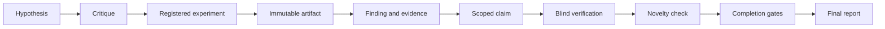

# Multi-Agent Research Tool

Local Python CLI and MCP stdio server for evidence-gated research workflows in Codex, Claude Code, Kiro, Kilo Code, and Hermes.

## Features

- Separate roles for hypotheses, criticism, experiment design, execution, verification, novelty checks, and synthesis.
- Immutable raw artifacts with provenance and content/config hashes.
- Typed evidence graph: `Claim -> Evidence -> Finding -> Experiment -> Artifact`.
- Blind verifier context that excludes the producer's conclusion.
- Completion gates for evidence, verification, novelty, and final reports.
- CLI for project setup and reports; MCP tools for the full research workflow.
- Failed, negative, disputed, and inconclusive results remain queryable.

## Install

Requirements: Python 3.11+.

Run once from a checkout with an isolated environment:

```bash
uvx --from . research-tool --help
```

Install the command persistently:

```bash
uv tool install .
research-tool --help
```

Without `uv`, install it into the active Python environment:

```bash
python -m pip install -e .
research-tool --help
```

For development and tests:

```bash
uv pip install -e ".[dev]"
python -m pytest
```

See the official [`uv` tools guide](https://docs.astral.sh/uv/guides/tools/) for `uvx` and `uv tool install`.

## Use

Initialize a research project and inspect its status:

```bash
research-tool init ./research-project
research-tool status --project ./research-project
```

Run the MCP server for a coding agent:

```bash
research-tool mcp --project ./research-project
```

The CLI also validates completion and writes a report after all gates pass:

```bash
research-tool validate \
  --project ./research-project \
  --claim C-001 \
  --limitation "Only the registered benchmark was evaluated"

research-tool report \
  --project ./research-project \
  --claim C-001 \
  --limitation "Only the registered benchmark was evaluated"
```

CLI output is JSON. Validation and report generation fail closed when the required evidence, verification, novelty, or writing gates are incomplete.

## Workflow



The synthesizer can write only from claims that pass the evidence, verification, novelty, and writing gates. Scope, limitations, contradictions, and negative results stay in the record.

## Coding-agent integration

Project-local MCP configuration is included for Codex, Claude Code, Kiro, and Kilo Code. Hermes has a ready-to-merge snippet because its documented MCP configuration is user-scoped.

See [`docs/integrations.md`](docs/integrations.md) for configuration and client-specific verification steps.

## Boundaries

This tool is the workflow and evidence boundary, not an LLM provider or truth oracle. It does not bundle web search, cloud credentials, a database, or arbitrary experiment execution. External agents provide research sources, environment metadata, and raw experiment outputs.
